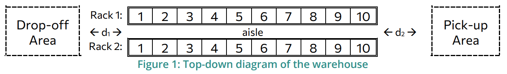
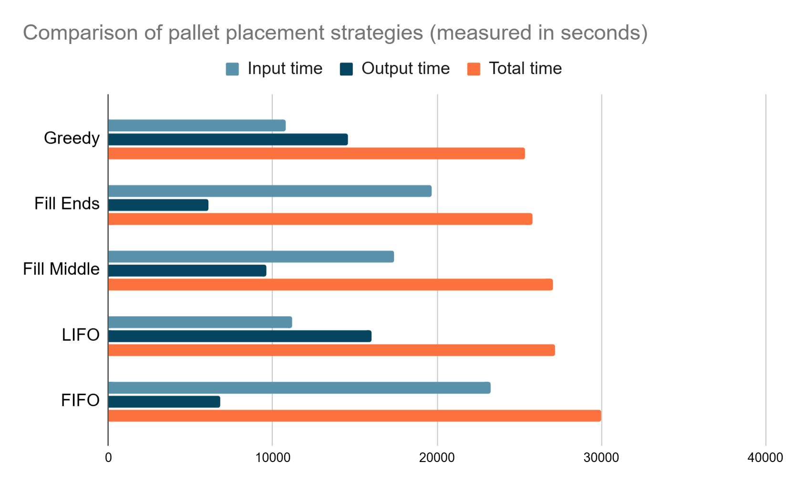

## Python Technical Exercise: Single Picker Routing Problem

# Running the code

0. Have Python installed
1. Clone the github repo on your machine
2. Navigate to the root folder of the repo
3. Run `pyhton app.py`

**Note**: The code was developed and tested using Python 3.10.12 on Ubuntu 22.04

# Exercise Definition

## 1. Introduction

**Objective**: Develop a Python script that optimizes the positioning of goods in a
warehouse based on category-specific placement rules and historical activity logs,
aiming to minimize operational time.

**Scenario**: The warehouse contains two racks facing each other, each consisting of 10
bays with 4 shelves per bay. Each shelf hosts up to 3 europallets (bpallet = 0.8m) side-by-
side. Categories of goods are defined with specific placement rules:

- **Category A:** Only placed on the bottom shelves.
- **Category B:** Only placed on the top shelves.
- **Category C:** Can be placed on any shelf.

Goods are delivered and retrieved from the warehouse with a designated drop-off area
at one end of the aisle and a pickup area at the other end. Logs of placements and
retrievals for a month. During a typical day, goods to be delivered to the warehouse are
the first to be positioned and then the retrieval process starts.

### Parameters

- d1 = d2 = 5 m
- brack = 3 m
- bpallet = 0.8m
- hshelf = 1.8 m
- vforklift = 1.2 m/s
- vlift = 0.5 m/s 

## 2. To-do

**Part 1: Data Import and Entity Definition**

- **Data Import:** Import data from two CSV files containing logs of goods
    placements (inputs) and retrievals (outputs) over a month.
- **Entity Creation:** Define classes for **Rack** , **Bay** , **Shelf** , and **Europallet** ,
    incorporating the category-specific placement rules.

**Part 2: Initial Simulation**

- **Simulate Initial Placement:** Model the placement and retrieval of goods based
    on the input and output logs while adhering to the category-specific
    placement rules.

**Part 3: Optimization**

- **Define Optimization Problem:** Aim to minimize the total operational time,
    considering constraints of category placement, walking, lifting, and placing
    times.
- **Implement Optimization Algorithm:** Apply a heuristic or other suitable
    optimization technique to determine the optimal goods placement strategy.

**Part 4: Simulation of Optimized Layout**

- **Optimized Simulation:** Execute the simulation using the optimized strategy
    and compare the results with the initial simulation to evaluate improvements.

**Part 5: Reporting**

- **Generate Reports:** Provide detailed reports and visualizations comparing
    efficiency improvements between initial and optimized simulations.

# Results

Five different approaches were tested for optimising the placement of pallets in the warehouse layout provided by the exercise description. Before going through the results, some general assumptions should be listed. These apply to all strategies, thus not affecting the final results:

1. There is only one employee at the warehouse
2. There are two forklifts, one used for inputs and the other one used for outputs
3. Each forklift’s parking spot is within the drop-off and pick-up area
4. The employee changes forklifts after finishing the placement of input pallets
5. The forklift can carry only one pallet at a time
6. 20 pallets of each category existed in the warehouse beforehand
7. All of the presented approaches adhere to the category-specific placement rules

**FIFO**: In this approach, pallets are placed in the first available position that is closer to the pick-up area. The aim of this is to minimise the operation time of the retrieval process but as a result the initial placement time increases. This approach is the worst out of the five with the highest total time of 30026.47 seconds (~ 8.34 hours), even though it has a low output time (but not the lowest).

**LIFO**: This approach is similar to FIFO, but it prioritises minimizing operation times during the initial retrieval, filling the bays from 1 to 10. Similarly to FIFO, this approach is also not very good. The initial placement time is low but the output times increase dramatically, resulting in a high overall time of 27176.67 seconds (~ 7.54 hours) which is better than FIFO but still not optimal.

**Fill Middle**: This approach prioritises the middle bays compared to the edge ones, meaning that bays 5 and 6 will be filled first, then 4 and 7 and so on. The aim of this is to normalise the times between input and output operations. The result is slightly better than the LIFO approach, reaching a total of 27044.47 seconds (~7.51 hours).

**Fill Ends**: The opposite of the previous approach is to fill the two ends of the racks first, leaving the middle bays as a last resort. The aim of this approach is again to distribute the pallets between the two ends and improve both input and output times. The result is indeed better, with a total time of 25785.73 seconds (~ 7.16 hours) and the lowest output time out of all five approaches.

**Greedy**: This approach follows a Greedy Heuristic algorithm to find the optimal positions to place and retrieve pallets. All of the possible candidates are taken into consideration and their operation times are calculated beforehand. In the end, the candidate with the lowest operation time is the one selected for the input/output action. This algorithm achieved the best results out of the five approaches, with a total of 25386.13 seconds (~7.05 hours) and one of the lowest input times. Comparing it to the first FIFO approach, we can see a 15.46% improvement, translating to 4640.34 fewer seconds equivalent to 1.29 hours. Comparing it to the LIFO approach, we can see a 6.59% improvement, translating to 1790.54 seconds equivalent to 0.49 hours.

| Strategy   | Input time (s) | Output time (s) | Total time (s) |
|------------|----------------|-----------------|----------------|
| Greedy     | 10781.53       | 14604.6         | 25386.13       |
| Fill Ends  | 19692.6        | 6093.13         | 25785.73       |
| Fill Middle| 17413.73       | 9630.73         | 27044.46       |
| LIFO       | 11148.07       | 16028.6         | 27176.67       |
| FIFO       | 23233.67       | 6792.8          | 30026.47       |

Table 1: Comparison of placement strategies, listed from best to worst (lowest time = better)

Figure 1: Comparison of placement strategies, displayed from best to worst (lowest time = better)