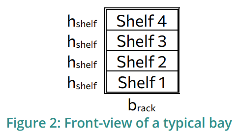

## Python Technical Exercise: Single Picker Routing Problem

# Running the code

0. Have Python installed
1. Clone the github repo on your machine
2. Navigate to the root folder of the repo
3. Run `pyhton app.py`

**Note**: The code was developed and tested using Python 3.10.12 on Ubuntu 22.04

# Exercise Definition

## 1. Introduction

**Objective**: Develop a Python script that optimizes the positioning of goods in a
warehouse based on category-specific placement rules and historical activity logs,
aiming to minimize operational time.

**Scenario**: The warehouse contains two racks facing each other, each consisting of 10
bays with 4 shelves per bay. Each shelf hosts up to 3 europallets (bpallet = 0.8m) side-by-
side. Categories of goods are defined with specific placement rules:

- **Category A:** Only placed on the bottom shelves.
- **Category B:** Only placed on the top shelves.
- **Category C:** Can be placed on any shelf.

Goods are delivered and retrieved from the warehouse with a designated drop-off area
at one end of the aisle and a pickup area at the other end. Logs of placements and
retrievals for a month. During a typical day, goods to be delivered to the warehouse are
the first to be positioned and then the retrieval process starts.

### Parameters

- d1 = d2 = 5 m
- brack = 3 m
- bpallet = 0.8m
- hshelf = 1.8 m
- vforklift = 1.2 m/s
- vlift = 0.5 m/s 

## 2. To-do

**Part 1: Data Import and Entity Definition**

- **Data Import:** Import data from two CSV files containing logs of goods
    placements (inputs) and retrievals (outputs) over a month.
- **Entity Creation:** Define classes for **Rack** , **Bay** , **Shelf** , and **Europallet** ,
    incorporating the category-specific placement rules.

**Part 2: Initial Simulation**

- **Simulate Initial Placement:** Model the placement and retrieval of goods based
    on the input and output logs while adhering to the category-specific
    placement rules.

**Part 3: Optimization**

- **Define Optimization Problem:** Aim to minimize the total operational time,
    considering constraints of category placement, walking, lifting, and placing
    times.
- **Implement Optimization Algorithm:** Apply a heuristic or other suitable
    optimization technique to determine the optimal goods placement strategy.

**Part 4: Simulation of Optimized Layout**

- **Optimized Simulation:** Execute the simulation using the optimized strategy
    and compare the results with the initial simulation to evaluate improvements.

**Part 5: Reporting**

- **Generate Reports:** Provide detailed reports and visualizations comparing
    efficiency improvements between initial and optimized simulations.

## 3. Deliverables & Evaluation

**Deliverables:**

- Python source code.
- README with setup and execution instructions.
- Visualizations and comparative efficiency reports.

**Evaluation Criteria:**

- Effectiveness of the optimization strategy.
- Accuracy and realism in simulating warehouse operations.
- Code quality and clarity.
- Insightfulness of the final report.

